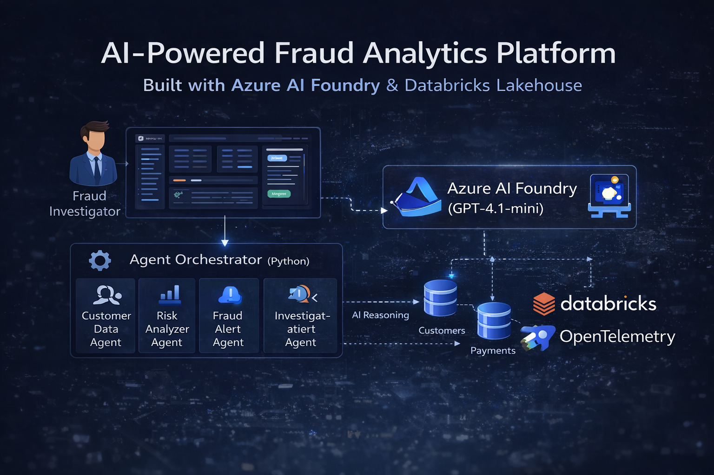
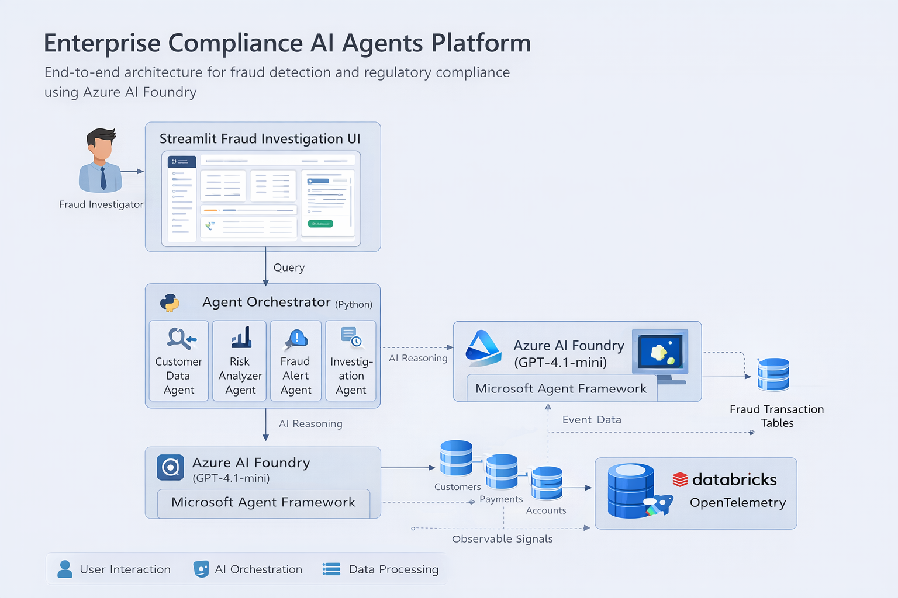
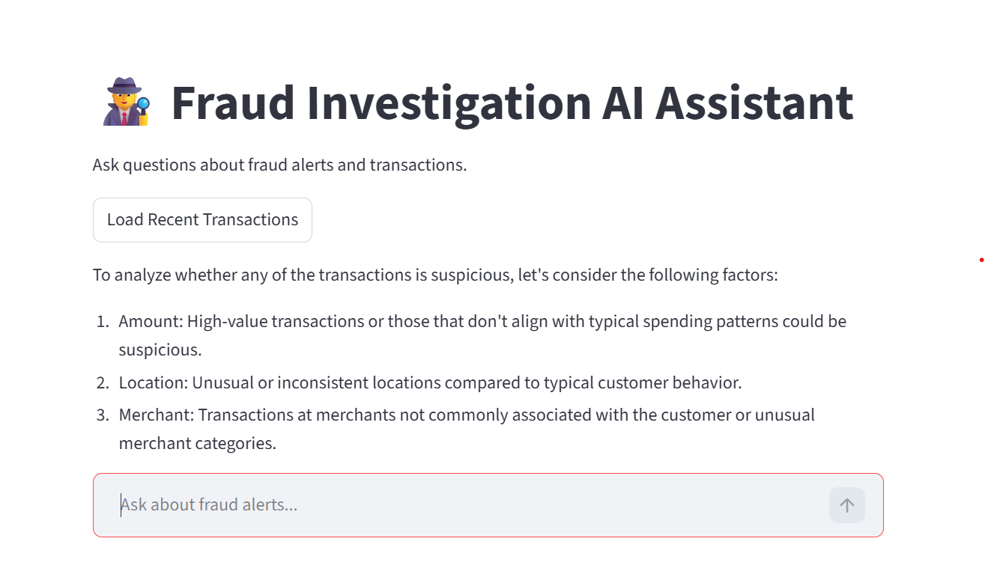
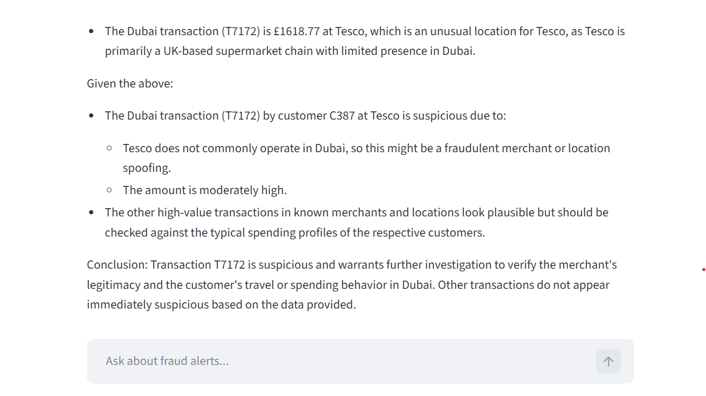
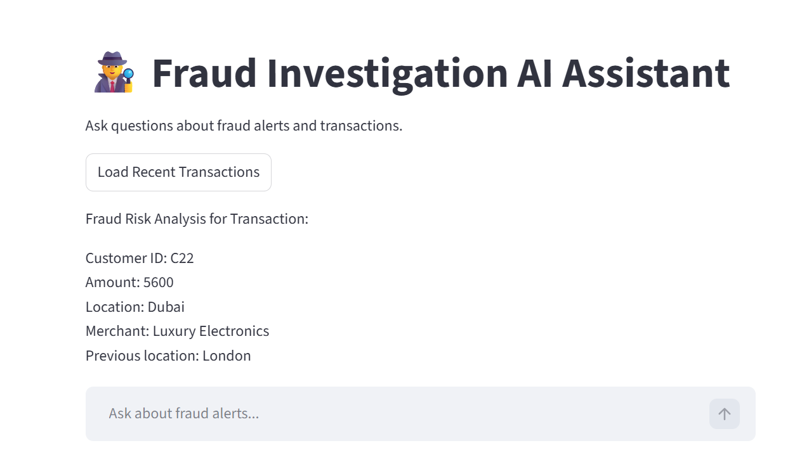

# AI-Powered Fraud Analytics Platform

### Built with Azure AI Foundry & Databricks Lakehouse

<p align="center">

</p>

---

## Overview

This project demonstrates how enterprise organizations can use **AI agents to automate fraud detection and compliance investigation workflows** using a modern **Lakehouse + AI architecture**.

The platform integrates **Azure AI Foundry** with a **Databricks Lakehouse** to analyze financial transactions, detect suspicious activity, generate investigation reports, and assist fraud analysts with AI-driven insights.

The system simulates a **multi-agent fraud investigation workflow** where different AI agents collaborate to evaluate financial transactions and produce compliance recommendations.

---

## Architecture

<p align="center">

</p>

### Architecture Layers

**Data Generation Layer**

* Synthetic financial transaction generation
* Customer profile simulation

**Data Platform Layer**

* Databricks Lakehouse
* Transaction datasets
* Data processing pipelines

**AI Layer**

* Azure AI Foundry
* GPT-4.1-mini reasoning model

**AI Agent Layer**

* Customer Data Agent
* Risk Analyzer Agent
* Compliance Report Agent
* Fraud Alert Agent

**Application Layer**

* Streamlit Fraud Investigation Dashboard

---

## Fraud Investigation Dashboard

<p align="center">

</p>

The Streamlit dashboard allows investigators to:

* analyze transactions using AI
* generate fraud risk assessments
* investigate suspicious activity
* produce compliance investigation summaries

---

## Transaction Investigation Example

<p align="center">

</p>

Example investigation scenario:

**Customer ID:** C22
**Transaction Amount:** 5600
**Location:** Dubai
**Merchant:** Luxury Electronics

The AI system analyzes behavioral anomalies and potential fraud indicators.

---

## AI Fraud Explanation

<p align="center">

</p>

The AI generates:

* fraud risk score
* behavioral anomaly detection
* fraud explanation
* recommended investigation action

---

## Technology Stack

| Category      | Technology           |
| ------------- | -------------------- |
| AI Platform   | Azure AI Foundry     |
| Data Platform | Databricks Lakehouse |
| AI Model      | GPT-4.1-mini         |
| Application   | Streamlit            |
| Programming   | Python               |
| Observability | OpenTelemetry        |
| Data Storage  | Lakehouse Tables     |

---

## AI Agents

### Customer Data Agent

Retrieves and analyzes customer transaction history.

### Risk Analyzer Agent

Evaluates financial transactions for fraud indicators.

### Compliance Report Agent

Generates investigation summaries and compliance reports.

### Fraud Alert Agent

Triggers alerts when suspicious transactions are detected.

---

## Example Investigation Prompt

Example query used in the system:

```
Analyze this transaction for possible fraud.

Customer ID: C22
Transaction Amount: 5600
Location: Dubai
Merchant: Luxury Electronics
Previous transactions: London
```

The AI returns:

* fraud risk score
* explanation of suspicious behavior
* recommended investigation action

---

## Running the Project

### Install Dependencies

```
pip install streamlit openai databricks-sql-connector python-dotenv
```

### Start the Fraud Investigation Dashboard

```
streamlit run ui/fraud_ai_ui.py
```

The application will start at:

```
http://localhost:8501
```

---

## Repository Structure

```
compliance-agent-platform
│
├ notebooks
│   ├ generate_fraud_transactions.ipynb
│   ├ customer_data_agent.ipynb
│   ├ risk_analyzer_agent.ipynb
│   └ compliance_report_agent.ipynb
│
├ ui
│   └ fraud_ai_ui.py
│
├ docs
│   └ images
│       ├ thumbnail.png
│       ├ architecture.png
│       ├ fraud_ai_dashboard.png
│       ├ fraud_transaction_analysis.png
│       └ ai_fraud_explanation.png
│
└ README.md
```

---

## Future Enhancements

* real-time transaction streaming
* automated fraud scoring pipelines
* enterprise AI agent orchestration
* investigation workflow automation
* enterprise monitoring & logging

---

## Author

**Harshit Tripathi**
Lead Data Engineer

Portfolio
[www.harshittripathi.com](http://www.harshittripathi.com)

GitHub
https://github.com/harshitboots

---

